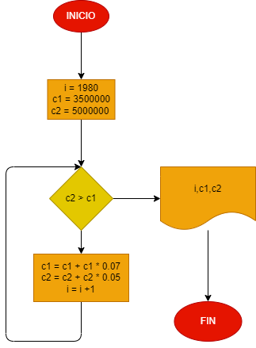

# En 1980 la ciudad A tenia 3.5 millones de habitantes, y tasa de crecimiento de 7% anual; y la ciudad B tenia 5 millones y una tasa de crecimiento de 5% anual. Si el crecimiento poblacional se mantiene constante en las dos ciudades, hacer el diagrama de flujo y el programa en Python que calcule e imprima en que año la población de la ciudad A es mayor que la de la ciudad B.

## Análisis.
Se le aumentará la debida tasa a cada ciudad y se detendrá cuando la población de la ciudad A supere a la de la ciudad B, y se imprima en que año lo supero y con cuantos habitantes quedaron cada uno.

## Diagrama de flujo.

